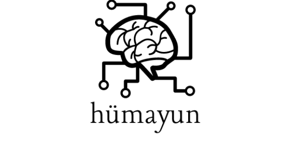

# AI Competition

QA for Turkish Contributions to Scientific Work.

## Dataset

[SQuAD](https://rajpurkar.github.io/SQuAD-explorer/) 
[Wikipedia](https://dumps.wikimedia.org/trwiki/) 

## Papers
[Question Analysis for a Closed Domain Question Answering System](https://www.cmpe.boun.edu.tr/~ozgur/papers/cicling2015.pdf) 
[Question Answering-Speech and Language Processing.  Daniel Jurafsky & James H. Martin](https://web.stanford.edu/~jurafsky/slp3/28.pdf) 
[Nerdle: Topic-Specific Question Answering Using Wikia Seeds](https://aclanthology.info/pdf/C/C14/C14-2018.pdf) 
[Special Section on Restricted-Domain Question Answering](https://www.mitpressjournals.org/doi/pdf/10.1162/coli.2007.33.1.41) 
[A Tri-Role Topic Model for Domain-Specific Question Answering](https://pdfs.semanticscholar.org/75f2/f792f921baf80dd7797639e2e7cfb3080bdf.pdf) 
[Biomedical question answering: A survey](https://ac.els-cdn.com/S0169260709002879/1-s2.0-S0169260709002879-main.pdf?_tid=ad9b46ea-6f6d-47bc-ba6b-c8a9cd425a1d&acdnat=1522658674_1ab935ebdfc984a2fb6255c8d8758cd3) 
[DeepQA](https://www.aaai.org/ojs/index.php/aimagazine/article/download/2303/2165) 

## Other Links

[Competition](http://teknofestistanbul.org/EN/technology-competitions/artificial-intelligence-competition) 
[Competition Rule](http://teknofestistanbul.org/Content/files/Teknoloji/EN/engArtificialIntelligenceCompetitionv4.pdf) 

# Credits

This application uses Open Source components. You can find the source code of their open source projects. We acknowledge and are grateful to these developers for their contributions to open source.

## Djangology

Special thanks to Emilia Apostolova, Sean Neilan, Gary An, Noriko Tomuro and Steven Lytinen (authors of [Djangology paper](http://www.lrec-conf.org/proceedings/lrec2010/pdf/543_Paper.pdf)) for providing us their [source code](https://sourceforge.net/projects/djangology/).  

[Djangology: A Light-weight Web-based Tool for Distributed Collaborative Text
Annotation](http://www.lrec-conf.org/proceedings/lrec2010/pdf/543_Paper.pdf) 
[Djangology Web Annotator](https://sourceforge.net/projects/djangology/) 

## Near-Duplicate Detection in Python

https://github.com/parkr/near-dup-detection

# License

GNU General Public License v3.0 

See [LICENSE](https://github.com/mcavdar/aicomp/blob/master/LICENSE) to read full text.

